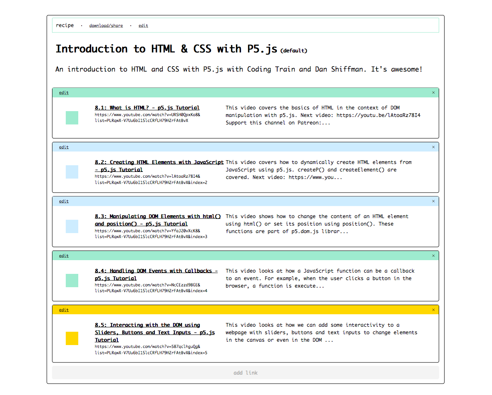

# How to be a Nautalist
A friendly, opinionated method for creating lo-fi, shareable, and reusable (and remixable?) lists of links in yaml

## What's a Nautalist?
> A Nautalist (as opposed to the cephlapod nautilus) is a wanna-be/made-up standard protocol for sharing lists of URLs with people across the web. Whether you're an educator trying to share an open list of educational resources with students or a parent passing a list of urls for recipes to your favorite dishes to your kids, formatting your list as a 'nautalist' can make it easy for both humans and computers to use.

Here's a simple example of a list of urls formatted in a friendly "nautalist" way:

> Nicely formatted in `YAML`...

```yaml
name: "Hello Lovely People!"
description: "Making shareable and usable lists of links make my heart warm"
features:
- url: "https://itp.nyu.edu"
  name: "ITP/IMA @ NYU"
  description: "Based at NYU"
- url: "https://thecodingtrain.com/"
  name: "@Shiffman's Coding Train"
  description: "All aboard the Coding Train with Daniel Shiffman, a YouTube channel dedicated to beginner-friendly creative coding tutorials and challenges."
- url: "https://p5js.org/"
  name: "p5js website"
  description: "p5js is a javascript library to make coding more accessible to everyone"
```

> ...yields nicely formatted `JSON`:

```json
{
  "description": "Making shareable and usable lists of links make my heart warm", 
  "features": [
    {
      "url": "https://itp.nyu.edu", 
      "name": "ITP/IMA @ NYU", 
      "description": "Based at NYU"
    }, 
    {
      "url": "https://thecodingtrain.com/", 
      "name": "@Shiffman's Coding Train", 
      "description": "All aboard the Coding Train with Daniel Shiffman, a YouTube channel dedicated to beginner-friendly creative coding tutorials and challenges."
    }, 
    {
      "url": "https://p5js.org/", 
      "name": "p5js website", 
      "description": "p5js is a javascript library to make coding more accessible to everyone"
    }
  ], 
  "name": "Hello Lovely People!"
}
```

> ... which can be used to generate very lovely webpages:




> ... and this makes sharing yours lists more accessible, beautiful, and functional, and delightful to experience for your friends, students, and loved ones. 


## Goal
> The ultimate goal is to make easy, pick-and-mix lists that can teach, inspire, catalog, and more -- basically anything and ordered list can do. Where does Nautilus come into view? This is a kind of a proof of concept for things I've been thinking about which revolves around how to make link collection, sharing, and remixing, easier to do. Ideally what we might accomplish is to create a methodology that requires little more than a clear set of instructions, the will to follow those instructions, and a place (e.g. a server or somewhere) that will serve up these lists of links in a nice way both as data and as a beautifully rendered view. 

## Structure


## Learning YAML

https://learnxinyminutes.com/docs/yaml/

