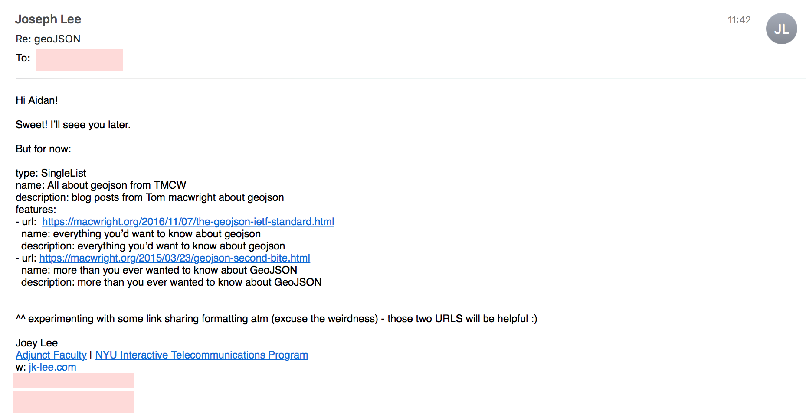

# How To: Basics
> A lo-fi/lo-tech approach to making lists friendly for humans and computers. 


## Making lists by hand

### Create a simple list
> Let's start by making a simple SingleList. Here we create a SingleList of my nautilist resources

```yaml
type: list
name: My Nautilist Resources
description: My list of nautilist resources
features:
- url: https://nautilist.github.io/
  name: The nautilist homepage
  description: Nautilist is a friendly set of tools for making lists
- url: https://nautilist.github.io/how-to
  name: The nautilist how to
  description: learn about making nautilists ;)

```

You can save this file on your computer `nautilist-resources.yml`


### Create a simple list of lists (multiple lists)
> Let's start by making a simple list of lists. Here we create a list of lists of my nautilist resources

```yaml
type: list
name: My Favorite Tools
description: A list of my favorite tools
features:
- type: list
  name: My Nautilist Resources
  description: My list of nautilist resources
  features:
  - url: https://nautilist.github.io/
    name: The nautilist homepage
    description: Nautilist is a friendly set of tools for making lists
  - url: https://nautilist.github.io/how-to
    name: The nautilist how to
    description: learn about making nautilists ;)
- type: list
  name: My Favorite Creative Coding tools
  description: My list of nautilist resources
  features:
  - url: https://p5js.org/
    name: P5js Homepage
    description: P5js is a javascript based library for creative coding
  - url: https://processing.org/
    name: Processing Homepage
    description: Processing is a java based coding environment
```
You can save this file on your computer `my-favorite-tools.yml`


## Saving your lists
> The nice thing about having these highly readable, structured lists is that they can live anywhere. You can send them in emails, store them as Github Gists or in Github (issues, as a file, etc), store them on dropbox, anywhere! You might imagine, if you start keeping all these lists on your hard drive in one place (e.g. a dropbox folder or your desktop folder), you can easily find, remix, and send these links to your friends, students, and family. 


## Sending your lists
> Everyone has their own systems for organizing and formatting lists. Nautilists are just one proposition for doing so. 

Sending a list might look like this:



## Lo-fi Collaborative Editing
> If you're looking for collaborative making and editing of lists, you can consider the following examples as ways to spark your collaborative link sharing ideas

### Github

Coming soon!

### Dropbox

Coming soon!

### Google Drive

Coming soon!


