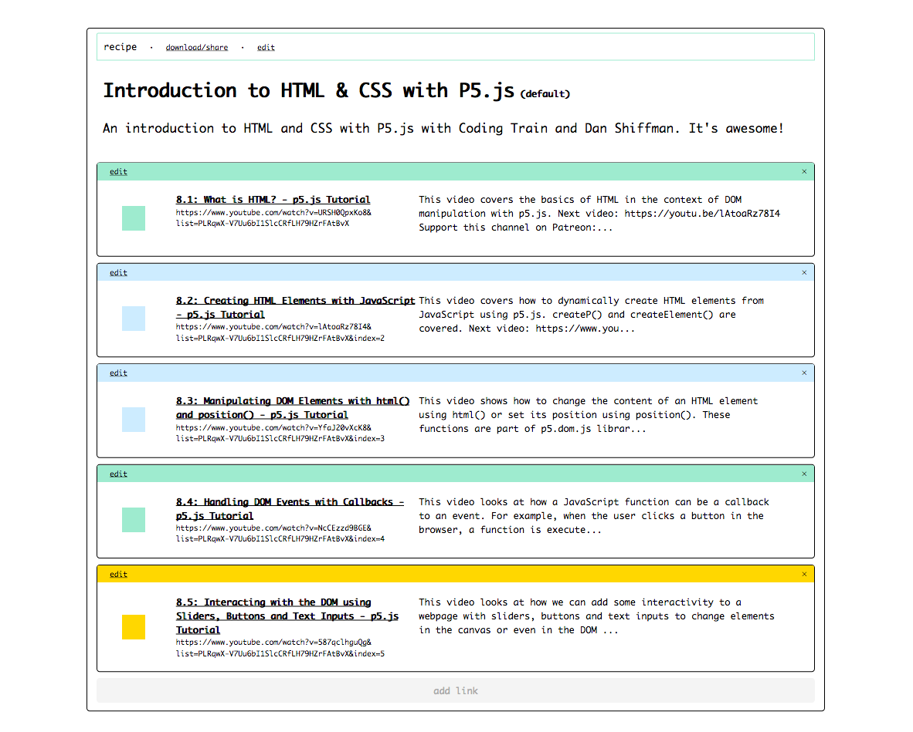
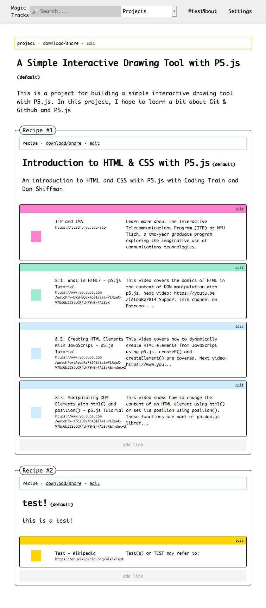

# How to be a Nautilist
A friendly, opinionated method for creating lo-fi, shareable, and reusable (and remixable?) lists of links in yaml


## What's a Nautilist?
> A Nautilist (==> the cephlapod, jules verne submarine, etc..) is a wanna-be/made-up standard "protocol" for sharing lists of URLs with people across the web. Whether you're an educator trying to share an open list of educational resources with students or a parent passing a list of urls for recipes to your favorite dishes to your kids, formatting your list as a 'nautilist' can make it easy for both humans and computers to use.

Here's a simple example of a list of urls formatted in a friendly "nautalist" way:

> Nicely formatted in `YAML`...

```yaml
type: "list"
name: "Hello Lovely People!"
description: "Making shareable and usable lists of links make my heart warm"
features:
- url: "https://itp.nyu.edu"
  name: "ITP/IMA @ NYU"
  description: "Based at NYU"
- url: "https://thecodingtrain.com/"
  name: "@Shiffman's Coding Train"
  description: "All aboard the Coding Train with Daniel Shiffman, a YouTube channel dedicated to beginner-friendly creative coding tutorials and challenges."
- url: "https://p5js.org/"
  name: "p5js website"
  description: "p5js is a javascript library to make coding more accessible to everyone"
```

> ...yields nicely formatted `JSON`:

```json
{
  "description": "Making shareable and usable lists of links make my heart warm", 
  "features": [
    {
      "url": "https://itp.nyu.edu", 
      "name": "ITP/IMA @ NYU", 
      "description": "Based at NYU"
    }, 
    {
      "url": "https://thecodingtrain.com/", 
      "name": "@Shiffman's Coding Train", 
      "description": "All aboard the Coding Train with Daniel Shiffman, a YouTube channel dedicated to beginner-friendly creative coding tutorials and challenges."
    }, 
    {
      "url": "https://p5js.org/", 
      "name": "p5js website", 
      "description": "p5js is a javascript library to make coding more accessible to everyone"
    }
  ], 
  "name": "Hello Lovely People!"
}
```

> ... which can be used to generate very lovely webpages:




> ... and this makes sharing yours lists more accessible, beautiful, and functional, and delightful to experience for your friends, students, and loved ones. 


## Goal

The ultimate goal is to make easy, pick-and-mix lists that can teach, inspire, catalog, and more -- basically anything and ordered list can do. Where does Nautilus come into view? This is a kind of a proof of concept for things I've been thinking about which revolves around how to make link collection, sharing, and remixing, easier to do. Ideally what we might accomplish is to create a methodology that requires little more than a clear set of instructions, the will to follow those instructions, and a place (e.g. a server or somewhere) that will serve up these lists of links in a nice way both as data and as a beautifully rendered view. 

One nice outcome of writing lists this way is that regardless of where you decide to create a list of links to share, there will always be a way for that list to be usable in any context whether as a flat file open in a text editor living on the web. 


## Supported Types
> Technically you can make lists and do whatever makes you happy, but if you structure our lists with one of the supported list structures below, you can take advantage of the [Nautilist App - coming soon!](#)


To be a `nautilist` all you have to do is make sure that your list follows these 4 rules:

1. you include a property called `type`
2. you include a property called `name`
3. you include a property called `description`
4. you include your list items in property called `features`

Have a look at the examples below for the `SingleList` and `MultiList` types and you'll see what I mean. 


### A Single List
> A single list as the name suggests, a single list of urls with a name and description. You might think of a single list as a single concept with related links. The urls in the `features` list should be ordered in the order as you'd like them to be read.

```yaml
type: "list"
name: "Handy P5.js Tools"
description: "This is a list of handy p5.js Tools ranging from commandline tools, project generators, and web editors."
features:
- url: "https://p5js.org/"
  name: "p5js website"
  description: "p5js is a javascript library to make coding more accessible to everyone"
- url: "https://editor.p5js.org/"
  name: "The p5js web editor"
  description: "A handy web editor for writing code in the browser and seeing your magic come alive"
- url: "https://www.npmjs.com/package/p5-manager"
  name: "P5 Manager commandline tool"
  description: "Commandline scaffolding tool for generating p5js projects"
- url: "http://1023.io/p5-inspector/"
  name: "P5 playground"
  description: "A What you see is what you get editor for p5.js"
```


### A List of Lists
> A list of lists is, as the name suggests, a list of lists. You might think of a list of lists as a set of related lists meant to be read in order from top to bottom. Conceptually, a list of lists might be thought of as a project that curates a set of lists that speaks to a higher level theme, project, lesson, or whatever your heart desires. Just know that that a list of lists contains other lists

```yaml
type: "list"
name: "The P5.js Landscape"
description: "This is a list of the P5.js landscape."
features:
- type: "list" 
  name: "Handy P5.js Tools"
  description: "This is a list of handy p5.js Tools ranging from commandline tools, project generators, and web editors."
  features:
    - url: "https://p5js.org/"
      name: "p5js website"
      description: "p5js is a javascript library to make coding more accessible to everyone"
    - url: "https://editor.p5js.org/"
      name: "The p5js web editor"
      description: "A handy web editor for writing code in the browser and seeing your magic come alive"
    - url: "https://www.npmjs.com/package/p5-manager"
      name: "P5 Manager commandline tool"
      description: "Commandline scaffolding tool for generating p5js projects"
    - url: "http://1023.io/p5-inspector/"
      name: "P5 playground"
      description: "A What you see is what you get editor for p5.js"
- type: "list"
  name: "P5 Libraries"
  description: "A list of libraries built for P5.js."
  features:
    - url: "https://p5js.org/libraries/"
      name: "P5 Libraries"
      description: "officially on the website"
    - url: "https://github.com/generative-design/generative-design-library.js"
      name: "Generative Design Library"
      description: "Generative Design library bundled with lots of other tools built for p5.js"
```

You can see that in order to create a list of lists you just need to include your single list as part of the `features` and add a dash (`-`) to the `type` property. And voila! Just like that you've create a list of lists that's beautifully structured and ready to be used easily across the web!

How this might be rendered could be something like this:




## Why specify `type:list` all the time?
> To be honest, we could probably leave it out, but I find it to be a handy for a number of reasons. 1. It is a helpful indicator for a beginning of a list, 2. It forces your brain into remembering what the structure of a nautilist list is. 

## Learning YAML
> All of this is based on YAML. Why YAML? Well, it's not perfect, but it is the closest thing to a file format with enough rules to allow you to do structured data things, but readable enough to not melt your brain while quickly making lists.

- [Learn X in Y Minutes: YAML](https://learnxinyminutes.com/docs/yaml/)
- [YAML Parser and generator](http://yaml-online-parser.appspot.com/) 
